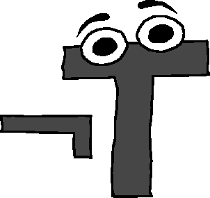

## Running
Compiled and tested with gcc 7.4.0

```
gcc not-true.c -o not-true && ./not-true
```

There are commented-out `printf`s within the code. If you were to uncomment them, the resulting faux-debug output would look something like this:

```
¬T 1[1+]!
PUSHED 1
FOUND LAMBDA AT 1
!!! 5
ENTERING LAMBDA FROM 5
PUSHED 1
POPPED 1
POPPED 1
PUSHED 2
EXITING LAMBDA FROM 4
```

If the user enters an empty line, a space-delimited list of integers on the stack will be printed:

```
¬T 1 999 42
¬T 
1 999 42 
```
## Examples
Some basic arithmetic:
```
¬T 1 3+2*.
8
```

Lambda functions are supported:
```
¬T 10[10*]!.
100
```

Nested lambdas are (crudely) supported; see the note below for details. Here is an example using a conditional:
```
¬T 1 1[1+[2+]?]!.
3
```

### Note
Currently, because of the way nested lambda functions are implemented, some expressions will not be correctly evaluated. For example:
```
¬T 1[[1+]![2+]!]!.
2
```
Is incorrect; the output ought to be `4`. The problem above is that `[2+]!` is ignored after the first instance of a lambda-within-a-lambda. I have a few ideas about how to fix this, such as keeping track of function substrings and iterating through each character (because at the moment this only occurs in the `enter_input` function).